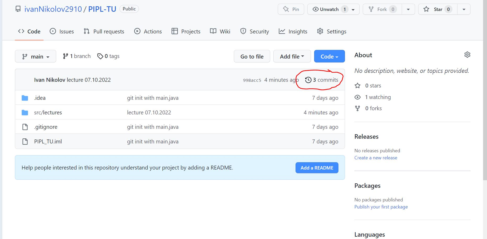
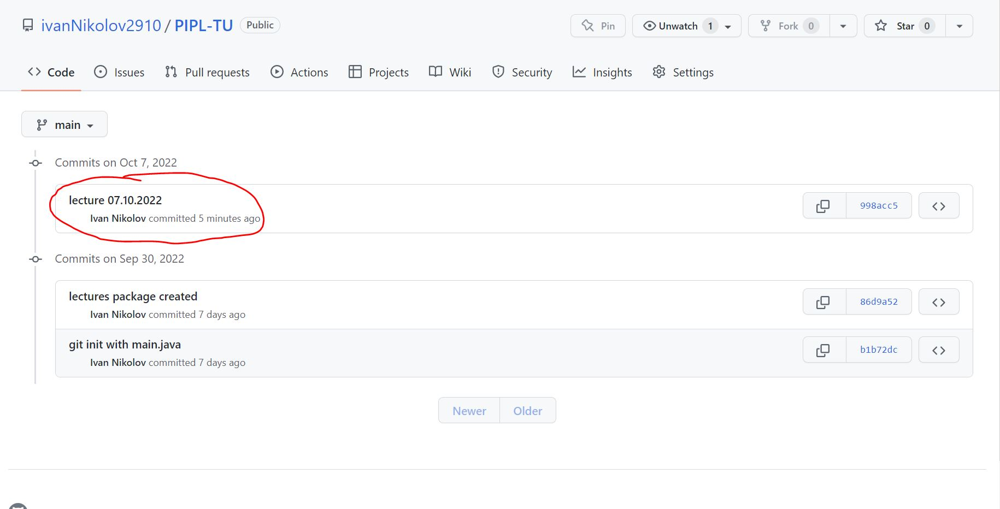
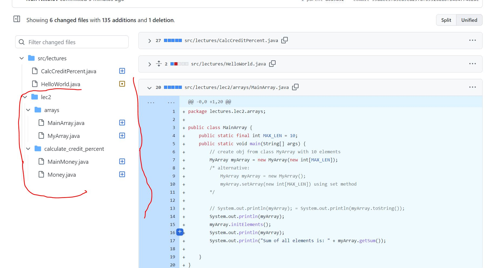

# PIPL_TU -> CSE semester 3
## Platform independent programming language 

## How to navigate to lectures and exercises?

1. Open commits tab
   
2. Navigate through commits to find lecture or exercise by name and date
   
3. Check files in this commit
   

#### Or just be a masochist and try to find what you want